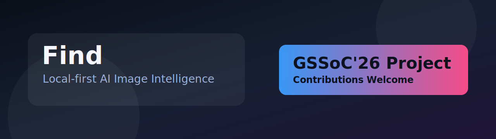

# Find

[](https://gssoc.girlscript.org/)
[](https://github.com/Abhash-Chakraborty/Find/actions/workflows/ci.yml)
[](https://github.com/Abhash-Chakraborty/Find/labels/good%20first%20issue)
[](https://github.com/Abhash-Chakraborty/Find/pulls)
[](./CONTRIBUTING.md)
[](./LICENSE)



Find is a local-first AI image intelligence platform for uploading, indexing, searching, and clustering images on your own machine.

All image processing, vector generation, and search stay inside your local stack.

## What it does

- Upload individual images or ZIP archives
- Extract captions, detected objects, OCR text, EXIF metadata, and dimensions
- Generate hybrid embeddings for semantic search
- Automatically cluster related images after indexing completes
- Browse gallery, inspect details, like/delete media, and review cluster members

## Tech stack

- **Frontend:** Next.js 16, React 19, React Query, Tailwind CSS, Biome
- **Backend:** FastAPI, SQLAlchemy, PostgreSQL + pgvector, Redis, RQ, MinIO
- **ML pipeline:** YOLOv10, Florence-2, PaddleOCR, SigLIP (`open-clip`), HDBSCAN

## Architecture

```text
Next.js frontend
    |
    v
FastAPI API
    |
    +--> PostgreSQL + pgvector  (metadata, embeddings, clusters)
    +--> MinIO                  (image object storage)
    +--> Redis + RQ             (background analysis and clustering jobs)
            |
            v
        ML worker
```

## GSSoC'26 contributors

This project is open for **GSSoC'26** contributions.

- Start with issues labeled [`good first issue`](https://github.com/Abhash-Chakraborty/Find/labels/good%20first%20issue)
- For medium/advanced work, check [`level 2`](https://github.com/Abhash-Chakraborty/Find/labels/level%202) and [`level 3`](https://github.com/Abhash-Chakraborty/Find/labels/level%203)
- Look for priority queue items via [`help wanted`](https://github.com/Abhash-Chakraborty/Find/labels/help%20wanted)
- Follow the contribution rules in [CONTRIBUTING.md](./CONTRIBUTING.md)

## Install and run

### Option A: one-command demo stack (recommended)

From repository root:

```bash
docker compose up --build
```

Services:

- Frontend: `http://localhost:3000`
- Backend API: `http://localhost:8000`
- MinIO API: `http://localhost:9000`
- MinIO console: `http://localhost:9001`

Notes:

- Current Docker setup is GPU-oriented and expects NVIDIA GPU access.
- If no root `.env` is present, compose defaults support local demo startup.

### Option B: local development without Docker

#### Prerequisites

- Node.js 18+ and `pnpm`
- Python 3.12 and `uv`
- PostgreSQL with `pgvector`
- Redis
- MinIO (or S3-compatible storage)

#### 1. Clone and configure env

```bash
git clone https://github.com/Abhash-Chakraborty/Find.git
cd Find
cp .env.example .env
```

#### 2. Backend API

```bash
cd backend
uv sync --group dev
uv run uvicorn find_api.main:app --reload
```

#### 3. Worker (separate terminal)

```bash
cd backend
uv run rq worker --url redis://localhost:6379 high default low
```

#### 4. Frontend (separate terminal)

```bash
cd frontend
pnpm install
pnpm dev
```

## Local quality checks

### Frontend

```bash
cd frontend
pnpm check
pnpm build
```

### Backend

```bash
cd backend
uv run ruff check .
uv run ruff format --check .
```

## Core flow

1. Frontend uploads images to `/api/upload` or `/api/upload/bulk`.
2. Backend stores files in MinIO and creates `media` rows in PostgreSQL.
3. Uploads are queued through RQ.
4. Worker extracts metadata and generates embeddings.
5. Backend queues clustering once indexing succeeds.
6. Frontend polls job status and updates gallery/search/cluster views.

## Key endpoints

- `POST /api/upload`
- `POST /api/upload/bulk`
- `GET /api/status/{job_id}`
- `GET /api/gallery`
- `GET /api/image/{media_id}`
- `POST /api/image/{media_id}/like`
- `DELETE /api/image/{media_id}`
- `GET /api/search?q=...`
- `GET /api/clusters`
- `GET /api/cluster/{cluster_id}`
- `POST /api/cluster/run`

## Configuration notes

`.env.example` reflects the current stack. Keep `EMBEDDING_DIM` aligned with the selected CLIP/SigLIP model and pgvector dimensions.

## Contribution quick start

1. Pick an issue and comment to get assigned.
2. Fork and create a branch from `main`.
3. Make changes with focused commits.
4. Run quality checks from CONTRIBUTING.
5. Open a PR using the project template and link the issue.

## Contact and support

- Use [GitHub Issues](https://github.com/Abhash-Chakraborty/Find/issues) for bugs/features/questions.
- For contributor context, tag maintainers in your issue or PR (`@Abhash-Chakraborty`).
- Follow [Code of Conduct](./CODE_OF_CONDUCT.md) in all interactions.

## License

MIT
